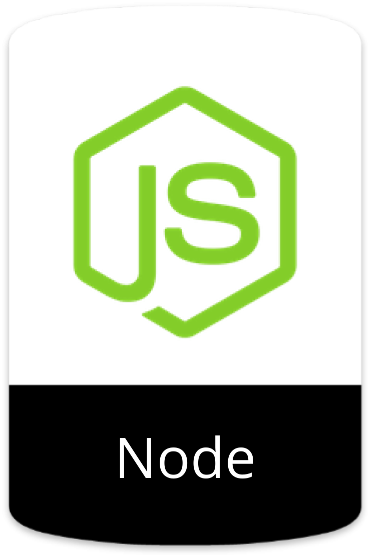

### Farid Hidayat - Product Engineer

I'm a Product Engineer, Tech Consultant & IT Business Consultant keen on building and shipping innovative products geared toward simplifying, and improving people life.

### Tech Stack

### Porducts
#### Kurawal
#### Brokoli
#### Pinterkelas

### Projects
#### Gofleet Driver - Gojek & Astra
Aplikasi khusus untuk mitra driver gofleet untuk menerima informasi pemberitahuan, membaca kebijakan, mengajukan pertanyaan mengenai segala hal terkait operasional mitra driver gofleet.

Technology:
- React Native
- Webapp (React.js)
- Node (REST API)
- SQL Server

#### Densus88 - Internal App
Manual book app reader for Densus' members

Technology:
- Flutter
- Webapp (React.js)
- Go (REST API)
- MySQL

#### IdeaFest 2019 - LOKET
Loket App Conference

Technology:
- Flutter
- Webapp (React.js)
- Node (REST API)
- MySQL

#### DEN - Digital Education Network
The Pioneer of Engagement Centre in Digital Education Network. All In One App

Technology:
- React Native
- Webapp (React.js)
- Node (REST API)
- MySQL

### Connect with me:

[][website]
<!-- [][youtube] -->
[][twitter]
[][linkedin]

[website]: https://faridlab.github.io
[twitter]: https://twitter.com/faridlab
<!-- [youtube]: https://youtube.com/faridlab -->
[linkedin]: https://linkedin.com/in/faridlab

 
 
 

 
Founder, **StartApp** 
w: https://startapp.id/ 
